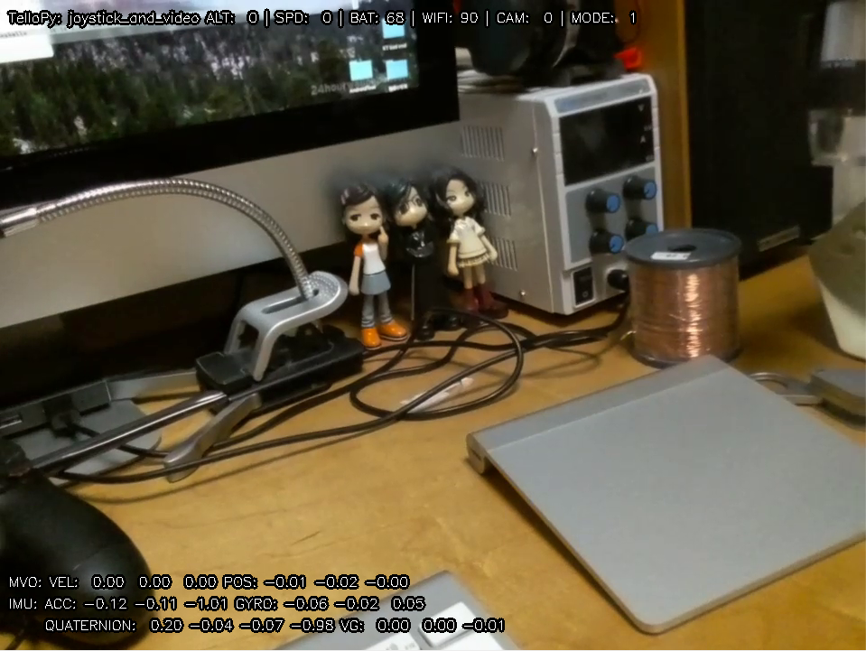

# DJI Tello drone controller python package

This is a python package which controlls DJI toy drone 'Tello'.


## How to install

```
$ git clone https://github.com/Danny-Dasilva/Simple-TelloPy.git
$ cd Simple-TelloPy
$ sh install.sh
```

## Simple example

```
$ python3 simple.py
```
## Documents
Please see the API docstring.
```
$ python
>>> import tellopy
>>> help(tellopy)
Help on package tellopy:
...
```

## Examples

You can find basic usage of this package in example code in the examples folder.


### video_effect
Filter and display the realtime video stream from Tello.
```
$ pip install av
$ pip install opencv-python
$ pip install image
$ python -m tellopy.examples.video_effect
```


### joystick_and_video
You can use PS3/PS4/XONE joystick to controll Tello.
(see my video https://www.youtube.com/watch?v=MWdNFRdRuj8)
```
$ pip install av
$ pip install opencv-python
$ pip install image
$ pip install pygame
$ python -m tellopy.examples.joystick_and_video

```



